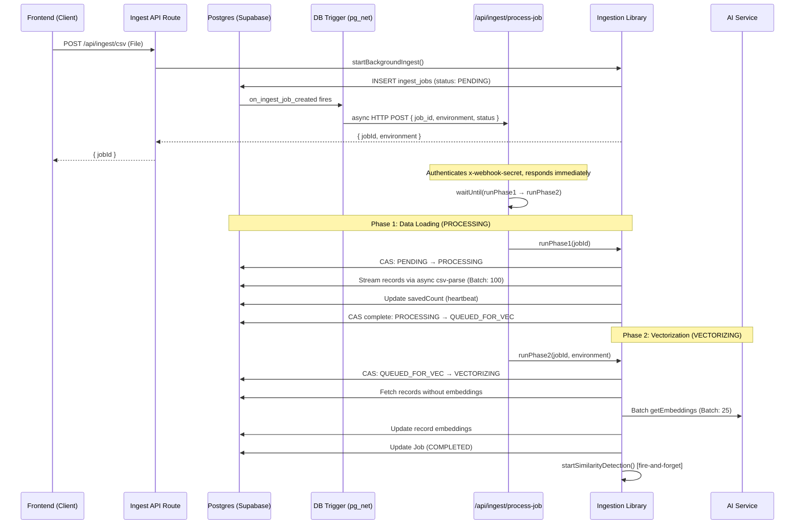
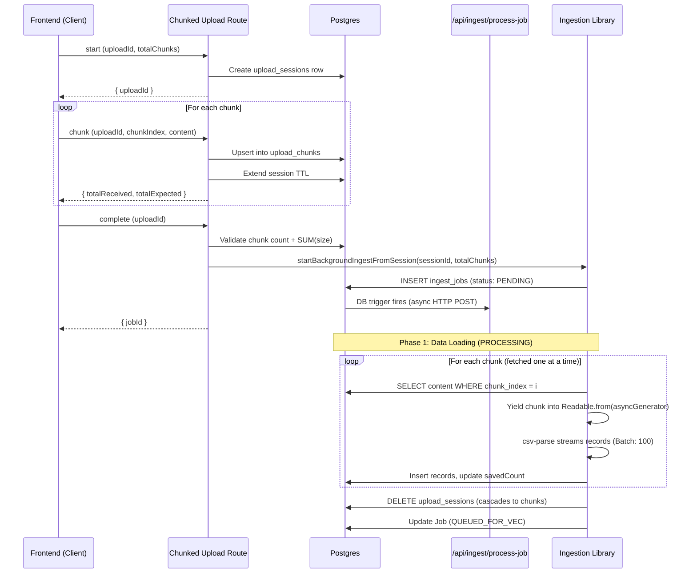

# Ingestion & Processing Flow

The ingestion system uses a webhook-driven, two-phase architecture to handle large datasets without blocking Vercel serverless function timeouts.

## How It Works

When a new `ingest_jobs` row is inserted, a Supabase DB trigger fires an async HTTP POST (via `pg_net`) to `/api/ingest/process-job`. That endpoint authenticates the request, responds immediately with `{ received: true }`, then uses Vercel's `waitUntil` to run Phase 1 and Phase 2 in the background — keeping the function alive up to `maxDuration = 300s` after the response is sent.

No polling, no cron job, no third-party queue service required.

## Process Lifecycle

### Standard CSV / API Upload



### Chunked Upload (Large Files)

Large CSV files are uploaded in chunks to avoid request body size limits. The ingestion pipeline streams chunks directly from the database during Phase 1 — the full file is **never assembled in memory**, keeping peak memory usage to ~one chunk (~4 MB) regardless of file size.



### Phase 3: Similarity Detection

After Phase 2 completes, `startSimilarityDetection(jobId, environment)` is called as a fire-and-forget task (errors are logged but do not fail the job). It compares the cosine similarity of each new task's embedding against historical task embeddings from the same user. Any pair exceeding the configured threshold (default: 80%) is written to the `similarity_flags` table as an `OPEN` flag. Flags are surfaced in the **Similarity Flags** dashboard (Core app) for CORE, FLEET, MANAGER, and ADMIN users.

## Webhook Configuration

The trigger reads its URL and secret from `public.ingest_webhook_config`:

```sql
INSERT INTO public.ingest_webhook_config (key, value) VALUES
    ('url',    'https://your-fleet-app.vercel.app/api/ingest/process-job'),
    ('secret', 'your-secret')
ON CONFLICT (key) DO UPDATE SET value = EXCLUDED.value;
```

The `WEBHOOK_SECRET` environment variable in Vercel must match the `secret` value. If `url` is not set or empty, the trigger is a safe no-op — no requests are sent.

## Idempotency & Concurrency

Both phase functions use **atomic Compare-And-Swap (CAS)** status transitions:

```sql
UPDATE public.ingest_jobs SET status = 'PROCESSING', "updatedAt" = NOW()
WHERE id = $jobId AND status = 'PENDING'
```

`pg_net` delivers at-least-once, so a job may receive duplicate webhook calls. The CAS update returns 0 rows affected if the job has already been claimed, making all duplicate deliveries safe no-ops.

## Status Lifecycle

```
PENDING → PROCESSING → QUEUED_FOR_VEC → VECTORIZING → COMPLETED
                                                      → FAILED
                                                      → CANCELLED
```

| Status | Meaning |
|---|---|
| `PENDING` | Job created; webhook not yet received or processed |
| `PROCESSING` | Phase 1 running — parsing source and writing records to DB |
| `QUEUED_FOR_VEC` | Data loaded; Phase 2 not yet started |
| `VECTORIZING` | Phase 2 running — generating AI embeddings |
| `COMPLETED` | Both phases complete; embeddings available |
| `FAILED` | An error occurred; `error` column has details |
| `CANCELLED` | Cancelled by user before completion |

**Similarity job statuses** (tracked separately in `similarity_jobs`):

| Status | Meaning |
|---|---|
| `PENDING` | Queued but not yet scanning |
| `PROCESSING` | Actively computing cosine similarity and writing flags |
| `COMPLETED` | All pairs evaluated; `flagsFound` reflects new flags inserted |
| `FAILED` | Error during detection; ingestion job itself is unaffected |

## Error Handling & Recovery

### Errors During Processing

Both `runPhase1` and `runPhase2` wrap all processing in a try-catch. On any error:
1. The job is updated to `FAILED` with the error message
2. The payload is cleared (null) to free storage
3. The error is re-thrown so it appears in Vercel logs

### Zombie Detection

The `GET /api/ingest/status` endpoint detects jobs stuck in `PROCESSING` or `VECTORIZING` for more than 10 minutes (2× the 300s `maxDuration`). These are assumed to have been killed by a Vercel timeout and are automatically marked `FAILED` with an actionable message:

- `PROCESSING` → `FAILED`: "Ingestion timed out. Please re-upload the file."
- `VECTORIZING` → `FAILED`: "Vectorization timed out. Use retroactive vectorization to resume."

### Retroactive Vectorization

Jobs that fail during Phase 2 can be resumed via `POST /api/ingest/retroactive-vectorization`. This creates a new `ingest_job` row with status `QUEUED_FOR_VEC`, which triggers the webhook and runs Phase 2 directly — Phase 1 is skipped since records are already in the database.

## Performance

- **Phase 1 batch size**: 100 records per DB insert
- **Phase 2 batch size**: 25 records per AI embedding request
- **Memory**: Only one batch held in memory at a time (both standard and chunked paths)
- **Deduplication**: Records checked for uniqueness via `task_id`, `task_key`, or `id` before insertion
- **Parallelism**: Multiple jobs can load data simultaneously; vectorization is per-environment to avoid overloading AI hosts

## Cost Considerations (OpenRouter)

When using OpenRouter for embeddings:
- Each batch of 25 records incurs an API cost based on token count
- Large ingestion jobs may accumulate significant embedding costs
- Consider using LM Studio for high-volume ingestion to avoid costs
- The dashboard displays your remaining balance for monitoring
