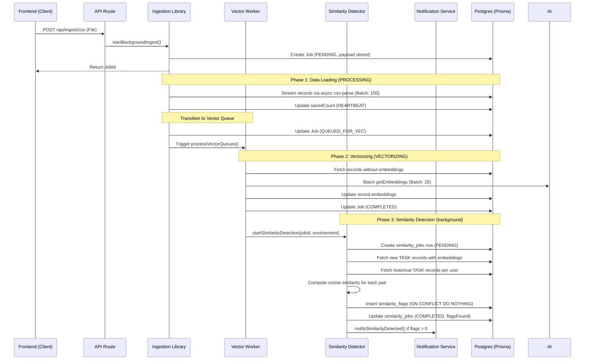
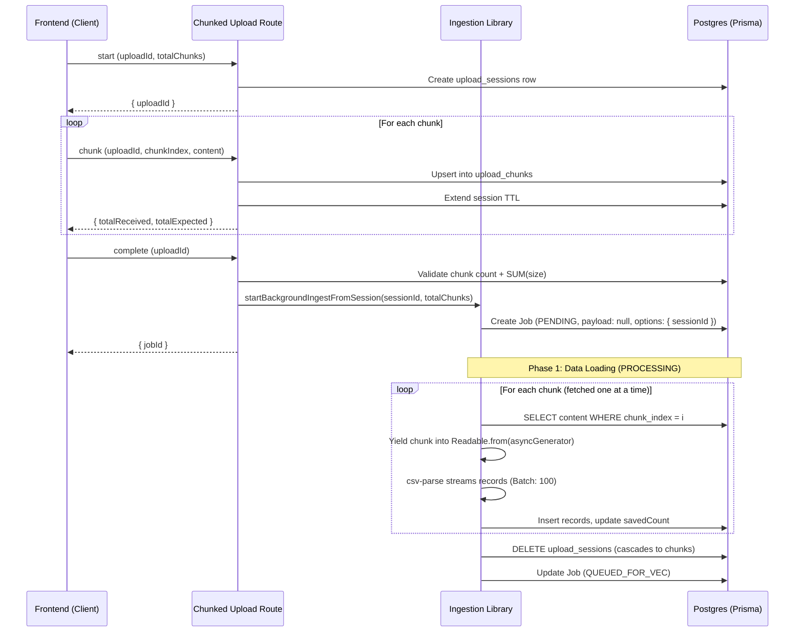

# Ingestion & Queuing Flow

The tool implements a high-performance, asynchronous, and parallelized queuing system designed to handle large datasets while maintaining a responsive UI and preventing local AI server overload.

## Process Lifecycle (Decoupled Phases)

Ingestion is split into two distinct phases to optimize for immediate data availability.

### Standard CSV / API Upload

### Phase 3: Similarity Detection

After vectorization completes, the system automatically runs a background similarity detection pass over the newly ingested records. This phase compares the cosine similarity of each new task's embedding against historical task embeddings from the same user. Any pair exceeding the configured threshold (default: 80%) is written to the `similarity_flags` table as an `OPEN` flag. Flags are surfaced in the **Similarity Flags** dashboard (Core app) for review by CORE, FLEET, MANAGER, and ADMIN users. The entire phase is non-blocking — ingestion completes regardless of similarity detection outcomes.

### Chunked Upload (Large Files)

Large CSV files are uploaded in chunks to avoid request timeouts. The ingestion pipeline streams chunks directly from the database during processing — the full file is **never assembled as a single string** in memory, keeping peak memory usage to ~one chunk (~4 MB) regardless of file size.

## Internal Mechanics

### 1. Parallel Execution
Unlike typical sequential queues, this system allows **Phase 1 (Data Loading)** of Job B to run while **Phase 2 (Vectorizing)** of Job A is still active.
- **Why?** Data loading is DB-bound and very fast. Vectorizing is GPU-bound and slow.
- **Result**: Users see their new records in the dashboard almost instantly, while AI enrichment happens in the background.

### 2. Multi-Stage Status Lifecycle

**Ingestion job statuses:**
- **PENDING**: Job is queued, waiting for its turn to load data.
- **PROCESSING**: The system is currently parsing the source and saving records to PostgreSQL.
- **QUEUED_FOR_VEC**: Data is safely stored, but the AI server is currently busy with another job.
- **VECTORIZING**: The AI server is actively generating embeddings for this job.
- **COMPLETED/FAILED/CANCELLED**: Terminal states.

**Similarity job statuses** (tracked separately in `similarity_jobs`):
- **PENDING**: Similarity detection has been queued but has not yet started scanning records.
- **PROCESSING**: The detector is actively computing cosine similarity and writing flags.
- **COMPLETED**: All pairs have been evaluated; `flagsFound` reflects the count of new flags inserted.
- **FAILED**: An unrecoverable error occurred during detection; the ingestion job itself is unaffected.

### 3. Queue Locking & Stability
- **Data Lock**: Only one job per environment can be in `PROCESSING` at a time to ensure database write order and prevent primary key collisions.
- **AI Lock**: Only one job per environment can be in `VECTORIZING` at a time to prevent overlapping requests from crashing local AI hosts (like LM Studio).

### 4. Recovery & Resumption
- **Zombie Cleanup**: On server restart, any jobs left in `PROCESSING` are automatically failed. For `CSV_SESSION` jobs, the upload session rows remain in `upload_chunks` until either the processor completes successfully or the session TTL expires (10 minutes), at which point opportunistic cleanup removes them.
- **Vector Resumption**: Any jobs in `QUEUED_FOR_VEC` or `VECTORIZING` can be resumed. The system scans for records missing embeddings and picks up exactly where it left off.

### 5. Performance Optimizations
- **Initial Load**: Using a `CHUNK_SIZE` of 100 for database insertions.
- **AI Batching**: We use a `BATCH_SIZE` of 25 for embeddings, significantly reducing network overhead to the local AI server.
- **Deduplication**: Every record is checked for uniqueness using `task_id`, `task_key`, or `id` before insertion.
- **Memory-Bounded Streaming**: Both standard and chunked CSV paths use the async `csv-parse` API. Records are processed in batches of 100 — only one batch is held in memory at a time regardless of total file size.

### 6. Cost Considerations (OpenRouter)

When using OpenRouter for embeddings:
- Each batch of 25 records incurs an API cost based on token count
- Large ingestion jobs may accumulate significant embedding costs
- Consider using LM Studio for high-volume ingestion to avoid costs
- The dashboard displays your remaining balance for monitoring
